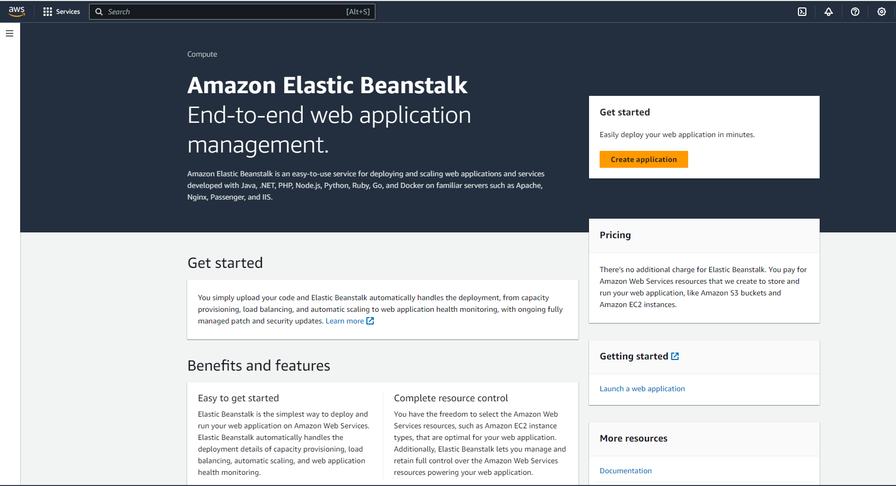
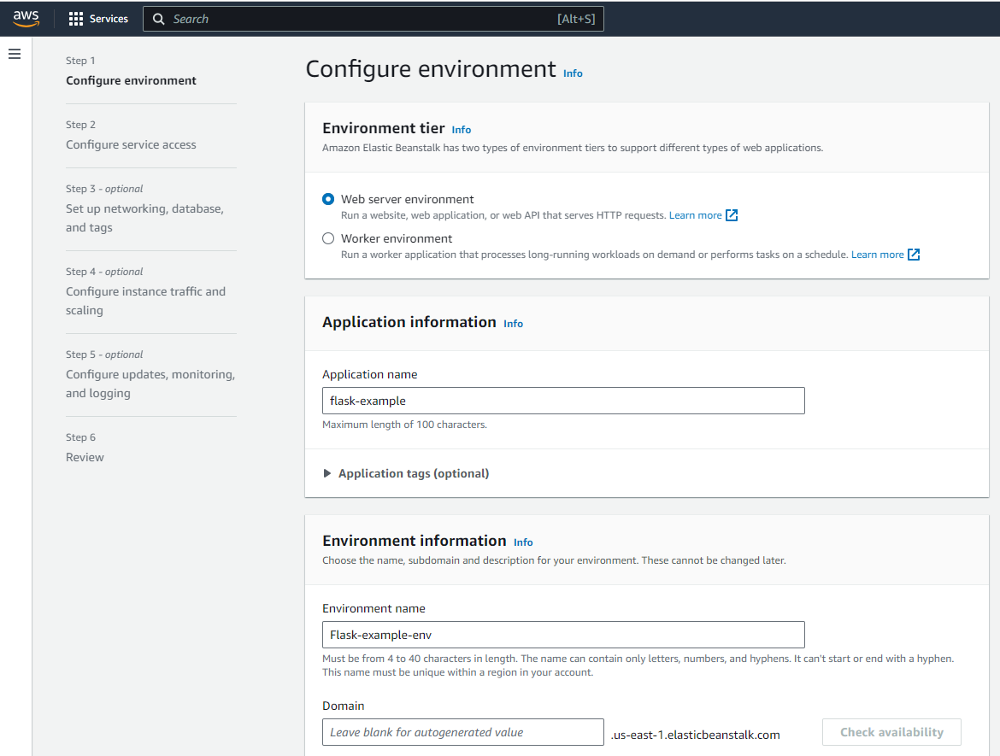
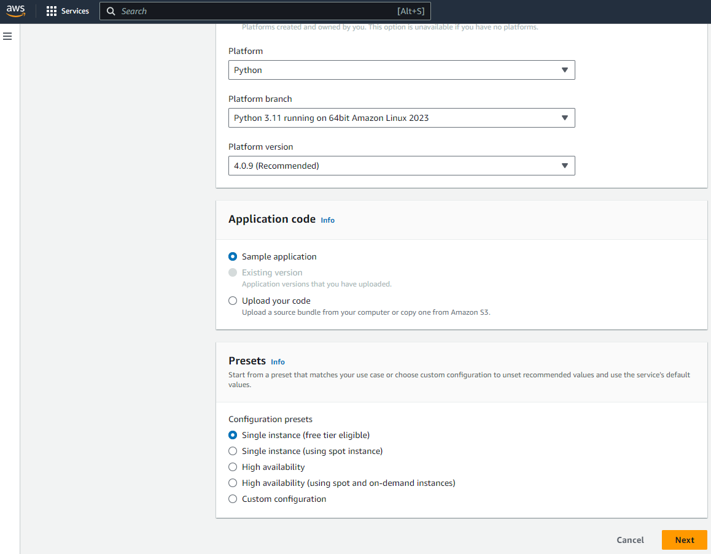

-----
Create Flask python web application and deploy it to Amazon Web Services Elastic Beanstalk
-----

In this project we also do CI/CD with Git. We build a web page that anybody can go view.
 We use Flask to do the python web development. Our approach is to isolate the smallest piece,
 which is taking the most simple application and getting that working online, and then we can add components
 as we go 

# 1. Create a virtual environment

The virtual environment is going to isolate our web application and all of the dependencies for our web application
are going to be just for that specific application. That means we can have multiple applications with different dependencies
and everything can still work

This command gives us a bunch of different python packages that we can use in our python projects: 

```bash
pip3 list
```

How ever, different projects are going to have different versions of these. So we want to basically isolate a smaller section
to have their own dependencies. So the way to create this virtual environment to isolate this smaller piece of section is:

```bash
python3 -m venv .venv
```

To activate our virtual environment:

```bash
source .venv/bin/activate
```

# 2. Install dependencies of our project

Now when we type:

```bash
pip3 list
```

We can see there is no packages installed yet.

We can upgrade pip first before:

```bash
pip3 install --upgrade pip
```

We can now install any dependencies that are specific for our project:

```bash
pip3 install flask
```

Now we can see that not only was flask installed, but a bunch of other dependencies that flask depends on:

```bash
pip3 list
```

That is goint to get everything we need for our project.

Now if we want to get this project up in source control or share accross numerous computers,
it is recommended to basically make a list of all these dependencies, and that way whenever someone downloads this project
they can install those same dependencies. The way to that is:

```bash
pip3 freeze > requirements.txt
```

To install the same packages listed in the *requirements.txt* file, we need to do this:

```bash
pip3 install -r requirements.txt
```

# 3. Building the application

Create anew python file called *application.py*. For default behaviour it's actually important to call it this way.
This is what is going to allow it to connect to aws very easily. However, there are some configurations if we want
to try to change that when we get to that point. 

We can create the file from the terminal by this way:

```bash
touch application.py
```

 To run the application locally before exporting it to AWS, to make sure everything is connected right locally before
 we deploy it to amazon web services, we will have to add the application to our path by creating environment variable:

 ```bash
export FLASK_APP="application.py"
```

Now to run Flask we just type:

```bash
flask run
```

 We get this warning: *WARNING: This is a development server. Do not use it in a production deployment. Use a production WSGI server instead*.
 We will use this development server just to make local testing, and then we will deploy to AWS.
 So, this project is giving us the solution to this warning pointed by Flask

# 4. Deploy the application in AWS

Go to the AWS Console and find Elastic Beanstalk and create new application. If you don't already have an AWS account, you will need to create an account. 



Configure the application. Choose *Python* as Platform, and *Sample application*. Don't *Upload your code*.
It is recommended to store our code in Github and have that automatically propagate to our server. Keep all the remain
configurations as default and create the production environment.





Once the app is running in AWS, go again to the Services and find *CodePipeline*. This Service can allow us testing and deployments.
But the only thing we are interested in here is taking our code from Github and getting it on AWS.

So, we are going to create a pipeline. Connect from AWS to you Github account and chooses the appropriate repository containing the code.
Fill the pipeline options. From now, when we will change something in this app locally and push it to Github, it is going automatically to refresh the pipeline
and get the new code, and then we can go and refresh the page and the changes will be there.

But this isn't exactly the most way to test development, but it is a nice way to now and again push to the server so people can test it out and you can just make sure everything
is working off of your machine.

Now the whole Continuous Integration and Continuous Deployment things can get pretty complex. So, for example, we could have an environment to do testing and then and environment to deploy to. Then you might want to push to the test server every night and make sure your changes are good, and then once a week push to the production server   
